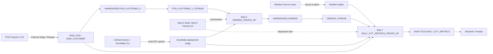

# Snowpark Data Engineering: Purpose Pause Week Study Guide

Study notes based on this repository's Snowpark data-engineering lab, with translations to healthcare quality registries and reporting. Features are identified as used, absent, or recommended; the lab is a learning prototype, not a production-compliance blueprint.

## 1. Snowflake Features Used

| Feature | Lab use | What it is, why used, and common applications |
|---|---|---|
| Snowpark Python | Steps 2, 4, 6, 7 | Python API for building transformations executed by Snowflake. Used for reusable joins, aggregations, and merges; useful when teams want Python composition without moving large datasets to a client. |
| Python Worksheets | Not used. The optional notebook is Jupyter, not a Python Worksheet. | Interactive Python development in Snowsight; useful for exploration and prototypes. |
| Python UDFs | Step 5 deploys a SciPy Fahrenheit conversion; Step 7 calls it. | Scalar Python function callable from SQL. Useful for reusable logic not conveniently expressed in SQL; prefer built-ins for simple operations. The inch conversion is a SQL UDF, not Python. |
| Python stored procedures | Steps 6 and 7 | Server-side Python handlers coordinate Snowpark and SQL operations. Useful for multi-step transformations, merges, and administrative routines. |
| Streams | On `POS_FLATTENED_V` and `ORDERS` | CDC offsets exposing changes since the last committed consumption. Useful for incremental pipelines. Reading does not consume; committed DML that consumes the stream advances its offset. |
| Tasks | Step 8 | Snowflake-managed scheduled or condition/dependency-based SQL/procedure execution. The lab uses stream conditions and task dependency; it manually starts the first task and defines no cron schedule. |
| Dynamic Tables | Not used | Declarative query-derived tables refreshed toward a target lag. Useful for SQL-first transformations where automatic refresh is suitable; an alternative for some custom stream/task pipelines, not a universal replacement. |
| Marketplace data product / sharing | Step 3: Weather Source shared database | Provider-published data queried in place without copying it into the lab database. Useful for licensed reference or enrichment data when sharing terms, residency, and governance allow. |
| External stage | Step 1 defines an S3 URL; Steps 2 and 9 read/load Parquet | Named pointer to files in cloud storage. Useful for controlled file ingestion. Private sources normally require storage integrations and scoped IAM. |
| Deployment stage | Snowflake CLI uploads Snowpark ZIP artifacts | Snowflake location for code packages imported by deployed handlers. Distinct from the external S3 source stage. |
| File formats and compression | Step 1 defines Parquet/Snappy | Reusable file parsing settings. Compression describes file encoding and is not encryption. |
| `COPY INTO` | Step 9 loads 2022 order files; Step 2 loads staged Parquet through Snowpark | Snowflake bulk-load DML with load history and format options; useful for repeatable staged-file ingestion. |
| Roles and grants | Step 1 creates `HOL_ROLE`, grants privileges, and assigns ownership | RBAC over account/database/schema/object actions. Production uses least privilege and separated developer, deployer, task-owner, and reader roles. |
| Warehouses | `HOL_WH` runs queries/tasks and is resized | Independent compute clusters. Useful for workload isolation and scaling compute separately from storage. |
| Databases and schemas | `HOL_DB`: `EXTERNAL`, `RAW_POS`, `RAW_CUSTOMER`, `HARMONIZED`, `ANALYTICS` | Namespaces and organization boundaries separating source, harmonized, and consumer data. |
| Information Schema and task history | Existence checks and monitoring examples | Metadata interfaces for inventory, execution observability, and operational automation. |
| Streamlit | Step 11 runs locally in Codespaces and is also deployed as `HOL_DB.ANALYTICS.SALES_METRICS_APP` in Snowflake | Python framework for custom interactive apps. The hosted app uses a Snowflake active session and `HOL_WH`; useful for tailored workflows when governed role access is appropriate. |
| Anaconda/Snowflake package repository | SciPy dependency for the Python UDF | Governed package distribution for Snowflake Python runtimes. Supports reproducible server-side dependencies without arbitrary network calls. |
| Snowflake CLI and GitHub Actions | Steps 5–7 and 11 deployment; Step 10 CI/CD | Build and deploy Snowpark and Streamlit project artifacts. Useful for repeatable deployments; production pipelines should add tests, approvals, promotion controls, and auditability. |
| External Access Integrations | Not used; handlers do not call external network APIs | Governed outbound network access for supported handlers. Use only when a handler genuinely must call an approved endpoint. |
| Snowflake Secrets | Not used by handlers. Local config and GitHub Actions secrets are separate credential mechanisms. | Secure credential objects for supported handlers, commonly with integrations. Not the same as `~/.snowflake/connections.toml`. |
| Other services | Snowflake shared database, SQL UDF, external object storage, and GitHub Actions | No Snowflake Secrets, External Access Integration, or Dynamic Table is implemented in this lab. |

## 2. Python Development Concepts

| Concept | How it works | Snowpark implementation and value versus SQL-only |
|---|---|---|
| DataFrames | Tabular abstractions with columns and composable transformations. | `session.table`, `select`, `join`, `group_by`, `agg`, and `merge` build relational plans. Enables Python composition while data remains in Snowflake; SQL may be simpler for straightforward relational logic. |
| Lazy execution | Transformations can describe work without immediately computing it. | Snowpark translates plans to SQL; actions such as `collect`, `show`, `count`, writes, and `merge` submit work. Avoid redundant actions that re-run plans. |
| Snowpark `Session` | Connection plus execution context. | Locally, a helper creates the session from a profile; stored procedure handlers receive a session. It exposes tables, SQL, DataFrames, and context. |
| Packages and dependencies | Python imports reusable external libraries. | App `requirements.txt` declares SciPy; Snowflake CLI resolves and deploys dependencies for the server runtime. Local and server packages/runtimes differ and both require testing. |
| Functions and handlers | Functions encapsulate logic and accept arguments. | `app.main` is the configured handler. The UDF accepts a temperature and returns a scalar; procedure handlers accept a Snowpark session and coordinate DML. |
| Transformations | Python expressions compose projections, joins, groups, aggregations, aliases, and schemas. | `snowflake.snowpark.functions` builds SQL expressions. Snowflake executes relational work; this avoids collecting source tables into local memory. |
| UDF calls | A function applies domain logic to values or columns. | Step 7 invokes deployed conversion UDFs with `F.call_udf`. Prefer built-ins for simple math when runtime/package overhead is unnecessary. |
| Pandas | In-process Python DataFrame library. | Streamlit calls `.to_pandas()` on a query result for charting. Appropriate for bounded result sets, not unbounded patient-level data. |
| Error handling | Python exceptions and `try/except/finally` control failure paths. | Lab error handling is limited; warehouse resize-down/session cleanup are not consistently protected by `finally`. Production code should clean up, report failures, and avoid swallowing exceptions. |
| Logging | Logs provide diagnostic context and severity. | Lab mostly uses `print`/`show`. Production should log run IDs, timings, row counts, and query IDs while excluding PHI, credentials, and sensitive literals. |

### Python and Snowpark function/API cheat sheet

Most calls in this lab are **not UDFs**. They are ordinary Python functions, Snowpark client APIs, or Snowflake built-ins represented as Snowpark expressions. A UDF is a specifically registered database function callable from SQL; a stored-procedure handler is a Python entry point that coordinates work.

| Call or construct | Category | Where and why it is used |
|---|---|---|
| `get_snowpark_session()` / `get_snowflake_config()` | Project Python helpers | Loads a local connection profile and creates a `Session`; not SQL functions and not UDFs. |
| `table_exists(session, schema, name)` | Project Python helper | Queries `INFORMATION_SCHEMA.TABLES` and returns a Boolean so Steps 6/7 create target tables only when absent. |
| `load_raw_table(...)`, `load_all_raw_tables(...)`, `validate_raw_tables(...)` | Project Python helpers (Step 2) | Organize staged Parquet loads, loop over tables/years, and optionally inspect resulting schemas. |
| `create_pos_view(session)`, `create_pos_view_stream(session)`, `test_pos_view(session)` | Project Python helpers (Step 4) | Build the flattened POS view, create a stream with SQL, and optionally display sample rows. |
| `main(...)` | Python handler function | Entry point named in `snowflake.yml`. Step 5's `main(temp_f)` is a scalar UDF handler; Step 6/7's `main(session)` is a stored-procedure handler. Same Python name, different database object type and signature. |
| `get_data()` and Streamlit `main()` | Application Python functions (Step 11) | Query metrics, convert a bounded result to Pandas, and render interactive charts. These are app functions, not Snowflake UDFs. |
| `if __name__ == '__main__'`, `sys.argv`, `*args` | Python runtime/control flow | Enables local debugging and optional command-line arguments. Deployment uses the configured handler instead of this local entry block. |
| list/dict comprehensions, `**` unpacking, loops, aliases, f-strings | Core Python language | Build column lists and merge-update dictionaries, iterate table/year lists, pass arguments, and format output. For example, `[*SHARED_COLUMNS, extra_field]` creates a new schema-field list. |
| `Session.builder.configs(...).create()` | Snowpark connection API | Creates a client session for local scripts. Deployed stored procedures receive their session from Snowflake. |
| `session.table(...)`, `session.sql(...)`, `session.use_schema(...)` | Snowpark Session methods | Refer to Snowflake tables, submit SQL, and set the active schema. `session.sql` is a SQL bridge, not a UDF. |
| `select`, `join`, `group_by`, `agg`, `with_column`, `distinct`, `limit` | Snowpark DataFrame methods | Describe relational transformations. They generally build a lazy query plan rather than immediately moving data to Python. |
| `F.col`, `F.to_date`, `F.avg`, `F.sum`, `F.max`, `F.round`, `F.current_timestamp` | Snowpark expression helpers | Create column expressions that translate to Snowflake SQL expressions/built-ins. These are not user-defined Python functions running row-by-row in the client. |
| `F.call_builtin("ZEROIFNULL", ...)` | Snowpark built-in invocation | Calls Snowflake's built-in `ZEROIFNULL`; it does not call a custom UDF. |
| `F.call_udf("ANALYTICS.FAHRENHEIT_TO_CELSIUS_UDF", ...)` | UDF invocation | Generates a call to the previously deployed Fahrenheit conversion database UDF. |
| `F.call_udf("ANALYTICS.INCH_TO_MILLIMETER_UDF", ...)` | UDF invocation | Calls the deployed inch-to-millimeter SQL UDF. Despite using `call_udf`, the target UDF itself is SQL, not Python. |
| `StructField`, `StructType`, `DateType`, `StringType`, `DecimalType`, `TimestampType` | Snowpark schema/type constructors | Define the empty `DAILY_CITY_METRICS` table's column names and types. They describe schema, not row values. |
| `session.create_dataframe(...).na.drop().write.mode(...).save_as_table(...)` | Snowpark DataFrame/write APIs | Creates a one-row all-null DataFrame, drops the null row, then writes the remaining empty schema as the initial target table. |
| `create_or_replace_view(...)`, `copy_into_table(...)`, `merge(...)` | Snowpark persistence/DML APIs | Create the view, load staged file rows, and perform target-table upserts. These issue Snowflake operations; they are not UDFs. |
| `F.when_matched().update(...)`, `F.when_not_matched().insert(...)` | Snowpark merge action builders | Define what the `MERGE` should do for existing and new keys. They construct DML actions rather than Python row callbacks. |
| `collect()`, `count()`, `show()`, `to_pandas()` | DataFrame/session actions or conversion | `collect` returns results to Python; `count` computes a count; `show` displays rows; `to_pandas` transfers results to local memory. They can trigger execution, so use them intentionally. |
| `convert_temperature(...)` | Third-party Python function inside UDF | SciPy performs the Fahrenheit/Celsius conversion in the UDF handler. This is a Python library function, not itself a Snowflake UDF. |

**Quick classification:** `F.avg(...)` is a Snowpark API expression for a SQL aggregate; `F.call_builtin(...)` explicitly names a Snowflake built-in; `F.call_udf(...)` invokes a registered UDF; `main(session)` is the stored-procedure handler; and `main(temp_f)` in Step 5 is the Python UDF handler.

## 3. Data Engineering Patterns Demonstrated

| Pattern | Where in lab | Real-world use and caveat |
|---|---|---|
| ELT | Load source data, then transform in Snowflake using views, Snowpark, SQL. | Land first and transform near governed storage; add contracts, batch metadata, quarantine, and versioning. |
| Data ingestion | S3 Parquet external stage; Snowpark load in Step 2; `COPY INTO` in Step 9. | Ingest registry, claim, EHR, or lab files. Add encryption, manifests/checksums, retention, replay, rejected-row handling, and freshness tracking. |
| Shared-data enrichment | Marketplace weather data in Step 3. | Use trusted reference datasets where license, residency, and governance allow. Healthcare data may have tighter restrictions than public weather data. |
| Incremental processing | Streams on flattened POS view and `ORDERS`; merge to target tables. | Process changed entities only. Explicitly handle updates, deletes, late data, duplicate delivery, retries, and stream staleness. |
| CDC / event-driven execution | `SYSTEM$STREAM_HAS_DATA` task conditions; `AFTER` dependency. | Trigger processing when changes exist. This is data-driven in-platform execution, not a universal replacement for an event bus. |
| Upsert / merge | Step 6 matches order detail ID; Step 7 matches date/city/country. | Maintain current state or aggregates. Define stable keys, delete/correction semantics, and replay-safe aggregation. |
| Orchestration | Step 8 task chain; Step 9 manual incremental rerun. | Use Tasks for Snowflake-local work; external orchestration may still be needed for cross-system workflows, approvals, and richer retry policies. |
| Scheduling | Tasks are created, but no cron schedule is specified; lab manually starts them. | Add schedules after defining freshness SLOs, overlap policy, retries, and ownership. |
| Data quality | Minimal checks: connection, table existence, counts, exploratory queries, task history. | Add schema, nullability, code set, referential integrity, duplicate-key, reconciliation, timeliness, and measure validation. Quarantine failures and record results per batch. |
| Metadata management | `META_UPDATED_AT`; Snowflake metadata and task history. | Add source/batch IDs, source event time, ingestion time, code version, run ID, and lineage. One timestamp is not full lineage. |
| Automation | GitHub Actions triggers CLI deployment on push to `main`. | Use tests, approvals, protected environments, least-privileged identities, and deployment audit history. |
| Consumption | Streamlit app and optional notebook. | Provide governed aggregate reporting and analysis with certified metric definitions. |

**Important incremental-processing caveat:** Step 7 aggregates rows from `ORDERS_STREAM` and merges those aggregate values into daily metrics. It does not filter all stream metadata (`METADATA$ACTION`, `METADATA$ISUPDATE`) or recompute complete totals for affected dates. Before adapting it, define how inserts, updates, deletes, corrections, and retries change aggregates and test replay behavior.

## 4. Architecture Walkthrough

1. **Sources:** POS Parquet files in a public Snowflake quickstart S3 prefix; weather history from Weather Source Marketplace.
2. **Marketplace integration:** The provider's shared database is queried in place rather than copied into `HOL_DB`.
3. **Ingestion:** `FROSTBYTE_RAW_STAGE` points at S3. Step 2 loads POS/customer files; Step 9 loads remaining 2022 orders.
4. **Storage:** `RAW_POS`/`RAW_CUSTOMER` are source-shaped; `EXTERNAL` holds stage/file format; `HARMONIZED` holds flattened view, streams, and orders; `ANALYTICS` holds UDFs and metrics.
5. **Transformation:** Step 4 joins six POS tables. Step 6 merges view-stream changes into `ORDERS`. Step 7 combines order changes and shared weather data.
6. **Business logic:** Temperature/unit conversion, daily sales aggregation, and keyed target merges.
7. **Orchestration:** Step 8 tasks conditionally chain order and metric procedures; Step 9 manually initiates an incremental reload.
8. **Consumption:** `DAILY_CITY_METRICS` feeds the local or Snowflake-hosted Streamlit app and an optional notebook.



### Step 11: Streamlit App, Hosting, and Tool Choice

#### What the app does

The app reads `HOL_DB.ANALYTICS.DAILY_CITY_METRICS`, computes daily and monthly views in SQL, and displays:

- City, month, and year selectors.
- Sales-versus-temperature scatter plot and sales-versus-precipitation box plot.
- Monthly time series comparing sales with temperature and precipitation.
- A correlation matrix and an optional raw-data table.

The app uses Snowpark to execute its SQL and converts the query result to a Pandas DataFrame for filtering and charting. This is convenient for the demonstration but means the current code fetches the full query result before applying the sidebar filters. It has no Streamlit cache. For larger datasets, push filters/aggregations into Snowflake, return only the needed rows/columns, and evaluate a short, policy-appropriate cache TTL.

#### Local versus Snowflake-hosted

| | Codespace/local Streamlit | Streamlit in Snowflake |
|---|---|---|
| Where the app runs | Python Streamlit server in the Codespace or developer machine. The forwarded Codespace URL exposes the local server. | Snowflake-hosted Streamlit runtime. The app is opened from its Snowflake/Snowsight URL. |
| Session/authentication | Uses `utils.snowpark_utils` and the local connection profile. | Calls `get_active_session()`; Snowflake supplies the active session. The hosted app does not read the local credentials file. |
| SQL compute | The app process runs locally; Snowflake executes queries using the connection's warehouse, here `HOL_WH`. | The Streamlit runtime is hosted by Snowflake; SQL queries use the `query_warehouse` declared in `steps/snowflake.yml`, here `HOL_WH`. |
| Deployment | `streamlit run 11_create_streamlit_app.py`; stop with Ctrl+C. | Snowflake CLI uploads the main file/environment to a Snowflake stage and creates the Streamlit object. The lab deployment is `HOL_DB.ANALYTICS.SALES_METRICS_APP`. |
| Main cost drivers | Codespace/machine runtime plus Snowflake warehouse usage for queries. | Snowflake Streamlit app compute plus the query warehouse used by SQL. Both can contribute to Snowflake spend. |

The original app was adapted to support both modes: it first tries `get_active_session()` for Snowflake hosting and falls back to the local Snowpark connection helper when no active Snowflake session exists. `steps/snowflake.yml` specifies the object name, database/schema, stage, query warehouse, entry file, and title. `steps/streamlit_environment.yml` declares the hosted Streamlit, Snowpark, Pandas, and Altair dependencies. The deployment script recognizes Streamlit projects and routes them to `snow streamlit deploy` rather than the Snowpark build/deploy commands.

For local preview, run from the `steps` directory:

```bash
conda activate pysnowpark
streamlit run 11_create_streamlit_app.py --server.enableCORS false --server.enableXsrfProtection false
```

To redeploy from the `steps` directory, use a connection name shown by `snow connection list`:

```bash
snow streamlit deploy --replace --connection <connection_name>
snow streamlit get-url HOL_DB.ANALYTICS.SALES_METRICS_APP --connection <connection_name>
```

Replace `<connection_name>` with the configured profile name; angle brackets are a placeholder, not literal shell syntax. The role used for deployment must be able to create/use the Streamlit object and its stage, and app viewers need the appropriate Snowflake access. Do not grant broad privileges just to make the app visible.

#### When to choose Streamlit, Snowflake dashboards, or BI tools

| Tool | Good fit | Tradeoffs |
|---|---|---|
| Streamlit in Snowflake | A custom Python-backed interface, purpose-built controls, calculations, or a workflow tightly coupled to Snowflake data and roles. | Code-owned UI requires Python maintenance, tests, deployment, and explicit query/resource management. It is not automatically cheaper than another option. |
| Snowflake dashboards | SQL-first operational monitoring and straightforward charts for users already working in Snowflake. | A good fit for simpler dashboards; less appropriate when the experience needs substantial custom Python logic or a specialized workflow. |
| Power BI or Tableau | Enterprise BI distribution, governed semantic models, broad self-service authoring, and dashboards spanning multiple platforms in an organization's existing BI ecosystem. | Adds BI licensing/platform administration and connector/governance considerations. Query and refresh architecture determines where compute and data movement occur. |

Choose based on audience, interaction needs, governed metric ownership, source systems, deployment model, and operating cost. For healthcare, keep PHI behind Snowflake authorization, minimize data sent to the app, and verify how the selected hosting and sharing mode maps to the organization's access and audit requirements.

## 5. Snowpark Deep Dive

### DataFrames and execution

A Snowpark DataFrame is a lazy relational plan, not necessarily an in-memory copy of a table. Calls to `select`, `join`, `group_by`, `agg`, and `with_column` compose the plan. Snowpark translates it to SQL; Snowflake optimizes and runs it when an action is requested, such as `collect`, `show`, `count`, a write, or `merge`.

### Snowpark versus Pandas

| Snowpark | Pandas |
|---|---|
| Execution occurs on Snowflake warehouse compute. | Execution occurs in the Python process. |
| Can describe operations over large tables without downloading all rows. | Data resides in application memory. |
| Uses Snowflake SQL semantics and Snowpark expressions. | Uses local Python/Pandas semantics and libraries. |
| Good for in-warehouse joins, filters, aggregates, and writes. | Good for bounded results, local exploration, and plotting. |

The Streamlit app's `.to_pandas()` is a data-transfer boundary. Filter and aggregate in Snowflake first; bound results, especially for patient-level data.

### Performance and best practices

- Push projections and filters early; avoid repeated actions that re-execute plans.
- Inspect query history/profile for scans, joins, spills, and skew.
- Prefer built-in SQL expressions to Python UDFs for simple logic when practical.
- Choose warehouse size from measured workload; isolate workloads where needed and use auto-suspend.
- Use explicit schemas, stable keys, deterministic transformations, idempotent merges, and transaction-aware stream consumption.
- Protect cleanup in `try/finally`; validate behavior locally and in Snowflake because runtimes/dependencies differ.
- Keep Pandas conversion bounded. Use appropriate numeric precision; the lab declares `DAILY_SALES` as string even though it sums numeric `PRICE`, a design to correct before production.

## 6. Production Readiness Assessment

| Component | Security / governance | Monitoring | Performance / cost opportunities |
|---|---|---|---|
| Roles and privileges | Lab uses `ACCOUNTADMIN` for setup and broad ownership/task grants. Production should provision with least privilege and separate developer, deployer, task-owner, and reader roles. Add classification, masking, and row-access policies where appropriate. | Audit grants, role use, privilege changes, and auth failures. | Reduce broad access and incident blast radius; use role-specific workloads. |
| Credentials and CI/CD | Local credentials stay outside source control; CI secrets are used to build a protected profile. Rotate credentials; prefer approved key-pair/OAuth/workload identity; use environment-scoped secrets; never log values. | Audit deployment identity and failed authentication. | Short-lived identity and approvals reduce secret drift and risk. |
| External files | Lab references public S3. For sensitive files use private storage, storage integrations, scoped IAM, encryption, retention, and approved network paths. | Track arrivals, load history, rejected records, duplicate files, and batch completeness. | Tune file sizes/parallelism; use load history/manifests to avoid unnecessary reloads. |
| Marketplace share | Verify permitted purpose, license, residency, refresh, and provider quality; do not join sensitive data without approval. | Monitor availability, freshness, and schema changes. | Query only needed columns/dates; copy shared data only with clear justification. |
| Procedures/UDFs | Validate handler rights, runtime, packages, code review, and data minimization. Avoid PHI in prints and exceptions. | Capture run/query IDs, timings, row counts, and failures; add structured error handling. | Profile query plans; use built-ins where adequate; scale based on measured work. |
| Streams and merges | Define update/delete semantics, keys, retries, transaction behavior, replay, and staleness recovery. Lab does not filter every stream metadata case. | Alert on stale streams, backlog age, unexpected deltas, duplicates, and merge counts. | Consume promptly; recompute affected aggregates where delta arithmetic is unsafe. |
| Tasks | Define owner, privileges, retry/timeout, overlap, failure dependencies, schedule/freshness SLO, and runbook. Lab manually starts tasks and sets no schedule. | Task history, error messages, query history, and alerts; test failure chains. | Avoid unnecessary polling; right-size task warehouse and auto-suspend. |
| Metrics and Streamlit | Publish only approved data; enforce access in Snowflake, not only UI. Ensure app identity cannot see extra data. | Monitor freshness, latency, access, and metric definition changes. | Push filters/aggregations down; bound `.to_pandas()`; cache only when permitted. |
| Quality and governance | Add contracts, lineage, retention/deletion, ownership, certified definitions, and audit. | Check numerator/denominator reconciliation, code validity, nulls, duplicates, timeliness, and exceptions. | Incremental processing saves compute only if late/corrected data yields accurate restated measures. |

This lab is a prototype, not a compliance blueprint. Healthcare deployment requires organizational privacy/security review, contractual and regulatory assessment, approved residency/retention, access controls, audit, and validated registry logic. Snowflake features by themselves do not establish HIPAA compliance.

## 7. Interview Prep

### 20 Snowpark interview questions

1. What is a Snowpark DataFrame, and how does it differ from Pandas?
2. What does lazy evaluation mean? Which operations trigger execution?
3. What does a `Session` represent in a client app versus a stored procedure?
4. How would you inspect or profile SQL generated by Snowpark?
5. When would you choose SQL, a Python UDF, or a stored procedure?
6. What package/runtime issues arise when deploying a Python UDF?
7. How does a Python procedure receive its Snowpark session?
8. Why can `.to_pandas()` be risky for large results?
9. How do Snowpark `join`, `group_by`, and `agg` map to relational work?
10. How do you avoid ambiguous columns after joins?
11. What is the difference between `collect`, `show`, and writing a DataFrame?
12. How can repeated actions cause redundant work?
13. How would you make a Snowpark `MERGE` idempotent?
14. How should a procedure handle warehouse/session cleanup after failure?
15. How are Python dependencies resolved for server-side execution?
16. How would you unit-test transformations separately from Snowflake integration?
17. How do you safely parameterize a handler or SQL query?
18. When is a Python UDF less suitable than a SQL built-in?
19. How would you optimize a large Snowpark join and aggregation?
20. What risks do `CREATE OR REPLACE` deployments pose for streams and procedures?

### Answer cheat sheet

1. **Snowpark vs Pandas:** Snowpark describes work that executes on Snowflake; Pandas executes locally in process memory. Snowpark suits large in-warehouse data; Pandas suits bounded extracts and local analysis.
2. **Lazy evaluation:** Transformations compose a plan; actions such as `collect`, `show`, `count`, write, or merge cause work to execute. Avoid repeated actions on the same plan.
3. **Session:** A client session authenticates and supplies context/API access. A procedure handler receives a session from Snowflake; it does not create a separate client connection.
4. **Inspect generated work:** Use Snowpark query history/query IDs and Snowflake Query Profile; inspect the SQL/query plan and measure scans, joins, spills, and elapsed time.
5. **Choose SQL/UDF/procedure:** Use SQL/built-ins for relational logic and simple expressions; use a UDF for reusable scalar logic; use a procedure to coordinate multi-step DML/control flow.
6. **Package/runtime:** Declare dependencies, pin/test compatible versions, ensure the Snowflake runtime supports them, and validate local and server execution separately.
7. **Procedure session:** Snowflake supplies it to the configured handler, for example `main(session)`. The handler uses that session for Snowpark/SQL operations.
8. **Pandas risk:** `.to_pandas()` transfers rows to local memory, which can cause memory pressure and expand the data-access boundary. Filter/aggregate first and cap result size.
9. **Relational mapping:** `join` combines keys, `group_by` defines groups, and `agg` calculates measures; Snowpark translates the operations into SQL for Snowflake execution.
10. **Ambiguous join columns:** Project only needed columns, use qualified DataFrame columns, rename with `alias`, and use suffixes where duplicate names remain.
11. **Actions:** `collect` returns rows to Python, `show` displays a sample, and a write persists results. All may execute the plan; only some transfer row data to Python.
12. **Repeated actions:** Each action may submit the plan again. Persist results when appropriate, or restructure code so diagnostic actions do not duplicate expensive computation.
13. **Idempotent merge:** Use a stable business key, deduplicate/normalize the source, define deterministic update/insert/delete rules, and ensure retries produce the same target state.
14. **Cleanup on failure:** Put warehouse resize-down and session close in `finally`; handle or propagate errors, and use transaction boundaries intentionally.
15. **Dependency resolution:** Declare packages in project requirements, resolve supported packages for the target Snowflake runtime, pin versions, and test the deployed artifact—not just the local environment.
16. **Testing:** Unit-test pure transformations and business rules with small fixtures; integration-test Snowflake SQL, permissions, streams, merge behavior, and task execution in a controlled environment.
17. **Safe parameterization:** Use Snowpark expressions/bind parameters for values, validate identifiers separately, and avoid string interpolation of untrusted values into SQL.
18. **Avoid Python UDF when:** The same logic is well served by a Snowflake built-in/SQL expression; that generally reduces package/runtime overhead and keeps optimization transparent.
19. **Optimize joins/aggregations:** Filter/project early, verify join keys and cardinality, inspect query profiles, avoid repeated actions and unnecessary data movement, and right-size compute based on measurement.
20. **Replace risks:** Replacing a stream can reset its offset and lose unconsumed change tracking; replacing procedures can disrupt grants/dependencies or create a deployment window. Prefer controlled promotion and explicit stream lifecycle management.

### 10 scenario-based Data Engineer questions

1. A registry sends corrected claims after publication. How do you restate affected measures and retain an audit trail?
2. A stream exposes old and new rows for an update. How will you prevent double counting?
3. The order task succeeds but the metrics task fails. How do you retry without losing or duplicating changes?
4. A shared reference dataset changes schema. How do you detect, contain, and communicate it?
5. Late data changes a prior period. Which aggregates must be recomputed?
6. A Snowpark pipeline pulls millions of rows into Pandas. How would you redesign it?
7. Hospitals use different code systems for one clinical concept. Where do you normalize and version mappings?
8. A measure denominator drops after deployment. What reconciliation and lineage help find the cause?
9. Authorized users need patient detail while general analysts need aggregates. How do you enforce access across Snowflake and an app?
10. A task warehouse is oversized and idle. How do you balance freshness and cost?

### 10 original advanced-certification-style questions

1. What operation advances a stream offset: (A) any `SELECT`, (B) `SHOW`, (C) committed DML that consumes it, or (D) warehouse resize?
2. Before an action executes, a Snowpark DataFrame is: (A) an in-memory table, (B) a lazy relational plan, (C) a permanent table, or (D) a Python list.
3. In this lab, an external stage versus deployment stage is: (A) same purpose, (B) source-file pointer versus uploaded code artifact, (C) local versus remote, or (D) warehouse versus database?
4. Which feature provides declarative query-derived tables refreshed toward a target lag: (A) Dynamic Tables, (B) Secrets, (C) Warehouses, or (D) Worksheets?
5. A task `AFTER` dependency plus stream condition expresses: (A) file format, (B) dependency and data availability, (C) grant, or (D) UDF package?
6. Why is `.to_pandas()` risky for large tables: (A) disables SQL, (B) transfers rows into client memory, (C) creates a stream, or (D) resizes a warehouse?
7. Resizing up then down without `finally` risks: (A) type loss, (B) warehouse left large on failure, (C) stream deletion, or (D) role reset?
8. Why define CDC update/delete semantics explicitly: (A) streams may expose metadata/multiple update rows, (B) Snowflake cannot merge, (C) views cannot join, or (D) tasks cannot use warehouses?
9. For simple arithmetic over large Snowflake data, the usual first choice is: (A) download to Pandas, (B) built-in SQL expression if adequate, (C) external API per row, or (D) Worksheet?
10. Least privilege for a task role means: (A) grant `ACCOUNTADMIN`, (B) grant only required privileges, (C) share one password, or (D) disable history?

**Answer key:** 1-C, 2-B, 3-B, 4-A, 5-B, 6-B, 7-B, 8-A, 9-B, 10-B.

### SnowPro Certification Prep

These are original practice questions based on concepts in this lab and common Snowflake knowledge areas; they are not actual or recalled exam questions. Use the current Snowflake exam guide to confirm the objectives for the certification you plan to take.

1. A stream has unread changes. Which action advances its offset?  
  A. Selecting rows from it  B. Running `SHOW STREAMS`  C. Committing DML that consumes it  D. Resizing its warehouse
2. What is the primary purpose of a virtual warehouse?  
  A. Permanent data storage  B. Compute for queries and workloads  C. Object naming  D. Authentication
3. What does an external stage represent?  
  A. A pointer to files in external storage  B. A Python environment  C. A task schedule  D. A database role
4. Which operation is typically used to bulk-load staged files into a table?  
  A. `COPY INTO <table>`  B. `SHOW TABLES`  C. `ALTER WAREHOUSE`  D. `CREATE STREAM`
5. How does a Marketplace shared database differ from copying source data into a local table?  
  A. Shared data can be queried through a share without the consumer first copying the provider's data  B. It is always a local CSV  C. It requires a Python UDF  D. It is a warehouse
6. What does `WHEN SYSTEM$STREAM_HAS_DATA(...)` do in a task definition?  
  A. Resizes the warehouse  B. Allows the task to run when the named stream has change data  C. Deletes consumed rows  D. Creates a stream
7. What is the key benefit of chaining a task with `AFTER <task>`?  
  A. Defines task dependency/order  B. Grants a role  C. Sets file compression  D. Changes a table schema
8. What is the principal distinction between a Snowpark DataFrame and a Pandas DataFrame?  
  A. Snowpark plans operations for Snowflake execution; Pandas operates in local process memory  B. Pandas always runs in Snowflake  C. Snowpark always downloads all rows  D. There is no distinction
9. Which operation is most likely to return query rows into the Python process?  
  A. `select()`  B. `join()`  C. `collect()`  D. `group_by()`
10. When should a Python UDF be preferred over a built-in SQL expression?  
   A. Whenever data is in Snowflake  B. When reusable Python logic or a required package justifies it  C. For every join  D. To create a warehouse
11. What does a stored procedure handler such as `main(session)` receive at runtime?  
   A. A Snowpark session  B. A warehouse object only  C. A Pandas DataFrame of the whole database  D. A stage URL only
12. What is the main risk of unbounded `.to_pandas()` on a large query result?  
   A. It advances a task  B. It transfers data to local memory and may exhaust memory or widen the data-access boundary  C. It creates a share  D. It changes the SQL role
13. What is a common purpose of `MERGE` in an incremental pipeline?  
   A. Upsert source changes into a target based on a match key  B. Resize compute  C. Copy a Marketplace share  D. Create a Python package
14. A role needs to execute a task but should not administer the whole account. What principle should guide its grants?  
   A. Least privilege  B. Grant `ACCOUNTADMIN`  C. Share a user's password  D. Disable audit history
15. How does a Dynamic Table differ from the Streams/Tasks pattern shown here?  
   A. It is a declarative query-derived table refreshed toward a target lag  B. It is an external stage  C. It is a Python function  D. It is a user role

**Answer key with rationale:**

1. **C** — A stream is consumed when committed DML reads it; a plain query does not advance its offset.
2. **B** — Warehouses provide compute; Snowflake storage is managed separately.
3. **A** — The lab's external stage points to Parquet files in S3.
4. **A** — `COPY INTO` bulk-loads staged files into a table.
5. **A** — Sharing exposes provider data under the share's access model without an initial consumer-side bulk copy.
6. **B** — It is a task condition based on stream change availability.
7. **A** — `AFTER` encodes upstream/downstream task order.
8. **A** — Snowpark plans work for Snowflake; Pandas computes in the client process.
9. **C** — `collect()` returns result rows to Python; other transformations generally build plans.
10. **B** — UDFs are useful when custom reusable Python/package logic justifies deployment/runtime overhead.
11. **A** — Snowflake supplies the Snowpark session to the procedure handler.
12. **B** — The result is transferred into application memory.
13. **A** — A keyed merge updates matches and inserts non-matches, according to its clauses.
14. **A** — Grant only the permissions needed for the task.
15. **A** — A Dynamic Table declaratively maintains query results toward a freshness target; it is not the same control model as hand-authored stream/task procedures.

**SnowPro quick cheat sheet**

- **Storage vs compute:** Tables/data reside in Snowflake storage; virtual warehouses provide compute and can be independently sized/suspended.
- **RBAC:** Roles receive privileges; users and other roles receive roles. Use least privilege and separate ownership, deployment, execution, and read access.
- **Stage vs file format:** A stage locates files; a file format tells Snowflake how to parse them. Compression is not encryption.
- **Share vs copy:** A share gives governed access to provider data; a table load creates consumer-owned copies with separate lifecycle and storage.
- **Stream vs task:** A stream tracks change offsets; a task runs SQL/procedures based on schedule, dependency, or a condition. A task does not itself store CDC rows.
- **Dynamic Table:** Declarative query-maintained data with a target lag; compare its refresh/correction behavior with explicit CDC pipelines.
- **Snowpark:** DataFrame transformations are lazy plans; Snowflake executes them when an action occurs. `collect`/`to_pandas` can move data to the client.
- **UDF vs procedure:** A UDF returns a value and is called in expressions; a procedure coordinates work and is invoked with `CALL`.
- **Incremental correctness:** Define keys, update/delete handling, deduplication, retries, stream consumption, late data, and restatement before relying on a merge.
- **Cost/performance:** Filter/project early, inspect query profiles, right-size warehouses, separate workloads where helpful, and suspend idle compute.
- **Security:** Keep credentials out of source control/logs; use managed identity/secret patterns, scoped integrations, masking/row policies, and audit.
- **Exam approach:** Read the verb carefully (create, consume, schedule, share); distinguish metadata from data, compute from storage, and client-side from server-side execution.

## 8. Apply to Healthcare Quality Registries and Reporting

### Potential Snowpark improvements

- Standardize registry extracts, claims, EHR events, lab results, provider, and facility reference data into conformed entities while keeping large joins in Snowflake.
- Use procedures for auditable multi-step batches, reconciliation, and controlled materialization; include run ID, source batch, code version, and effective time.
- Publish aggregate reporting views/tables with certified measure definitions. Filter/aggregate in Snowflake before transferring a bounded result to Streamlit or Pandas.
- Prefer SQL/Snowpark built-ins for routine parsing and calculation; reserve Python UDFs for reusable logic that benefits from Python packages or domain code.

### Tasks, Streams, and Dynamic Tables

- **Streams + Tasks:** Can handle source changes and trigger downstream in-platform work. Define correction, delete, duplicate delivery, retries, replay, and restatement first. They replace some Snowflake-local orchestration, not all cross-system scheduling/approval needs.
- **Dynamic Tables:** Consider for declarative SQL models and curated aggregates with acceptable target lag. Compare refresh behavior, cost, correctness, and late-correction requirements against explicit Streams/Tasks. They do not eliminate business-specific measure logic.
- **Data quality automation:** Check patient/member keys, required fields, code-set versions, chronology, provider/facility relationships, measure eligibility, numerator/denominator counts, duplicate submissions, late arrivals, and totals. Store results per batch; quarantine rather than silently dropping exceptions.
- **Predictive analytics:** Forecast measure completion, identify likely missing documentation, estimate workload, or trend outcomes. Apply validation, fairness, privacy, and clinical governance; do not treat an exploratory prediction as a validated clinical decision system.

### Healthcare safeguards

Treat PHI and sensitive health data as restricted. Apply minimum-necessary access, strong identity, row-access/masking policies, classification tags, encryption, audit, retention/deletion, and approved environments. Keep PHI out of prints, task errors, CI logs, query literals, and broad dashboard extracts. Confirm agreements, residency, and applicable obligations with privacy/security/legal teams; this study guide is not legal advice or a compliance determination.

## 9. Skills Gap Analysis

### Demonstrated by this lab

- Snowpark DataFrame composition and session use.
- Stage/file ingestion, Parquet, `COPY INTO`, and shared data access.
- UDF/procedure packaging and deployment.
- Streams, merges, task dependencies, and task-history inspection.
- Database/schema organization, roles, warehouses, and introductory CI/CD.
- Aggregate serving tables and a Streamlit/Pandas reporting app.

### Intermediate skills to develop next

- Correct CDC semantics for inserts, updates, deletes, late arrivals, and corrections.
- Idempotency, transactions, retries, replay, and stream-staleness recovery.
- Automated data contracts, reconciliation, schema evolution, quarantine, and measure testing.
- Query profiles, warehouse sizing, workload isolation, and cost attribution.
- Structured logging, lineage, alerting, task failure handling, and runbooks.
- Secure CI/CD identity, least privilege, environment promotion, and secrets practices.

### Advanced skills to develop next

- Dynamic Tables and freshness-driven design; benchmark against Streams/Tasks.
- Secure data sharing, storage integrations, masking/row-access policies, tags, and access history.
- Account architecture, residency, workload isolation, resilience, and recovery.
- Snowpark ML/model deployment and governed monitoring for quality analytics.
- Platform-as-code, deployment approvals, automated test matrices, and reusable enterprise templates.

### Career alignment

- **Senior Data Engineer:** Own reliable pipelines end to end: CDC correctness, tests, observability, cost controls, privacy-aware serving, and incident response.
- **Principal Data Engineer:** Establish shared engineering standards, contracts, quality patterns, platform adoption, and cross-domain reliability/cost tradeoffs.
- **Data Architect:** Define trust zones, ownership, access, lineage, residency/sharing, canonical registry entities, system boundaries, and long-term evolution.

## 10. Troubleshooting and Gotchas from Running This Lab

| Symptom | Cause | Resolution and lesson |
|---|---|---|
| `snow snowpark ...` reports that `snowpark` is an unknown command | The environment had the 2023 `snowflake-cli-labs==0.2.8` CLI, whose command layout predates the current project workflow. | The project was migrated to `snowflake-cli==2.8.2`, `snowflake.yml`, and `snow snowpark build/deploy`. Check `snow --help` and the package version before following older CLI instructions. |
| Deployment says Python runtime 3.8 is decommissioned | The old CLI template hardcoded `RUNTIME_VERSION=3.8`; a warning during local imports did not itself block execution, but Snowflake later rejected creation. | Set an explicitly supported runtime in the project definition and use the current CLI. Do not patch a generated or installed CLI SQL template as a lasting solution. |
| CLI fails looking for `connections.dev` or says the connection is missing | The old app configuration expected `app.toml` plus legacy `~/.snowsql/config`; the current CLI and connector use TOML connection profiles. | Use the current `snowflake.yml` project format and the profile name actually listed by `snow connection list`. The helper supports a sole named connection, but multiple profiles should be selected explicitly. |
| `Password is empty` while opening the app's Snowpark session | The selected profile had account/user/authenticator fields but no password, so password authentication could not succeed. | Add the password locally only if password authentication is intended, or configure the organization's approved SSO/key-pair method. Never paste credentials into chat or commit the file. The credentials file is outside the repository and should stay owner-only (`chmod 600`). |
| `No such file ...` when opening or launching a file | A relative path was repeated even though the terminal was already inside the target directory. | Check `pwd`; use `python app.py` inside the app directory or a path relative to the repository root. Shell launch commands belong in the terminal, not in a `.py` file. |
| `ModuleNotFoundError: scipy` or `No module named tomllib` | The command ran in the wrong environment, or an app dependency was not installed there. `tomllib` is in Python 3.11+, not Python 3.8. | Activate `pysnowpark` (Python 3.11), install the app's own `requirements.txt`, and verify with `python --version` and an import check. The current environment definition also includes `ipykernel` and `cachetools` for the notebook. |
| Snowflake says `Unknown function ORDERS_UPDATE_SP` | A stored procedure was invoked as a function, commonly with `SELECT`, or without the correct database/schema context. | Call it as `CALL HOL_DB.HARMONIZED.ORDERS_UPDATE_SP();`. Functions use expressions such as `SELECT ...UDF(...)`; procedures use `CALL`. |
| Local Streamlit has `No module named tomllib` | The Streamlit process used an older/different interpreter than the updated `pysnowpark` environment. | Stop the old process, activate `pysnowpark`, and start `streamlit run` from `steps`. Select the same interpreter in VS Code. |
| Snowflake-hosted Streamlit opens separately from the Codespace app | These are two deployments: the local Streamlit server runs in Codespaces; the hosted Streamlit object runs in Snowflake and uses its configured query warehouse. | Use the Snowflake app URL for the hosted version. Stop the Codespace server with Ctrl+C if it is no longer needed. Browser choice does not move execution between environments; corporate URL isolation may require an approved allowlist. |
| Notebook kernel reports `nbctl vsessions unavailable` on localhost:8888 | The Snowflake VS Code extension's own notebook session service was unavailable. That is distinct from a local Jupyter kernel. | Install Microsoft Jupyter extension, install/register `ipykernel` in `pysnowpark`, and select a Jupyter/Python kernel rather than the Snowflake extension kernel. |
| Notebook cell stays pending | The Jupyter log showed the kernel started but the cell never completed; the first imports cell also needed `cachetools`, which was absent. A fresh-process import test passed after adding it, but notebook execution still needs confirmation. | Restart the kernel, select the `pysnowpark` Python 3.11 Jupyter kernel, and run a small import cell. If it remains pending, inspect the Jupyter output log and kernel state; do not assume a Snowflake query is the cause when no cell has completed. |
| `git add .` appears to stage only a few changes | Git adds paths relative to the current directory. Running inside a nested `steps/...` folder does not stage changes above or beside it. | Run `git add -A` from the repository root, then inspect **Staged Changes**. `M `, `A `, and `D ` in `git status --short` indicate staged modification, addition, and deletion. Review unrelated pre-existing edits before committing. |

<!-- ...existing code... -->

## 11. Data Science & Machine Learning with Snowpark

### Objective

The data science notebook builds and deploys a model in Snowflake to predict food-truck shift sales. Its business goal is to help drivers choose locations expected to generate higher sales.

### Notebook workflow

1. **Prepare the data:** Snowpark aggregates order records into shift sales by location and shift, then saves the result to `HOL_DB.ANALYTICS.SHIFT_SALES`.
2. **Engineer features:** A window function calculates `AVG_LOCATION_SHIFT_SALES`, the historical average for each location and shift. Missing averages are filled with zero, and `SHIFT` is encoded numerically.
3. **Build training data:** Rows without `SHIFT_SALES` are excluded. Identifier columns (`LOCATION_ID`, `CITY`, and `DATE`) are dropped, and the remaining data is split into training and test sets.
4. **Train the model:** A Python stored procedure uses Scikit-learn `LinearRegression`. The features are `SHIFT_ID`, `SHIFT`, and `AVG_LOCATION_SHIFT_SALES`; the target is `SHIFT_SALES`.
5. **Save the artifact:** Joblib serializes the trained model to a file in the Snowflake stage `@MODEL_STAGE`.
6. **Deploy inference:** A Python UDF loads the staged model and returns predictions. Snowpark calls the UDF to score rows in Snowflake.
7. **Evaluate and use predictions:** The notebook calculates training and test RMSE, then ranks Vancouver locations by predicted sales for a selected shift.

### Results and interpretation

The supplied run notes report a training RMSE of **7,732** and test RMSE of **7,735**, with `AVG_LOCATION_SHIFT_SALES` reported as the strongest feature. Verify these figures against the notebook output before relying on them. RMSE is in the target's units (sales), and similar train/test scores alone do not establish that a model generalizes well; compare them with a suitable baseline and validate the split for time or location leakage.

The supplied feature-weight notes report `AVG_LOCATION_SHIFT_SALES` at approximately `0.793`, while `SHIFT_ID` and `SHIFT` are near zero. Treat these as run-specific coefficients, not universal feature importance: coefficient magnitudes depend on feature scales and the training data.

### Snowpark concepts demonstrated

- Window functions and feature engineering
- Training a Scikit-learn model in a Python stored procedure
- Saving a model artifact to a Snowflake stage
- Registering a Python UDF for inference
- Evaluating predictions with RMSE
- An end-to-end workflow: **prepare → train → save → deploy → predict**

### Operational and cost notes

The notebook scales `HOL_WH` to `MEDIUM` for inference, but its reset cell scales down `TASTY_DS_WH` instead. Verify which warehouse ran the notebook, then resize the correct warehouse back to an appropriate size and suspend it when no longer needed. Dropping tables and stages does not itself stop a running warehouse.

The training procedure collects the training table into Python memory. That is acceptable for a learning example, but may not scale to large datasets; measure memory and runtime before adapting this pattern.

### Possible healthcare applications

The same broad workflow could be explored for structured registry data—for example, estimating length of stay or readmission risk. These are potential analytical use cases, not validated clinical tools. They require appropriate data governance, validation, privacy safeguards, and clinical review. Working with clinical notes for sepsis-onset analysis would additionally require a carefully validated text-processing or NLP workflow.
## Purpose Pause Week Review

1. Draw the architecture and identify which committed DML advances each stream.
2. Explain why Marketplace data is queried in place and when a copy would be justified.
3. Distinguish the S3 source stage from the deployment artifact stage.
4. Design tests for stream update/delete semantics and aggregate restatement.
5. Propose least-privilege roles and PHI-safe observability for one registry feed.
6. Compare a Stream/Task implementation with a Dynamic Table and state which freshness/correction requirements decide between them.
